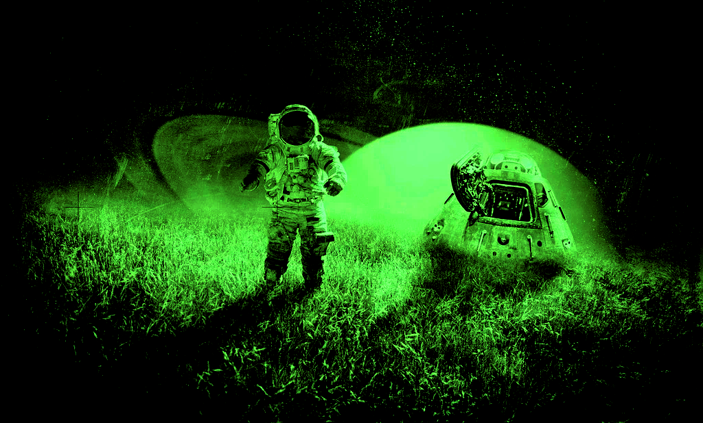

**HOSTILE** is a tabletop RPG set in a universe that combines elements of gritty science fiction, horror and intrigue.
It is heavily inspired by the aesthetics and themes of classic 1970s and 1980s sci-fi movies such as "Alien," "Blade Runner," and "Outland."
The [**setting**](https://www.zozergames.com/hostile-setting.html) is designed to evoke a sense of being on the edge of known space, where human life is cheap, corporate interests dominate, and the unknown looms at every corner.

Characters are blue-collar people, working dangerous jobs in the hostility of space.
Every hazard is trying to kill them: lack of oxygen, vacuum, radiation, excessive cold, excessive heat, aliens, alien infections, poisonous atmosphere, high-pressure atmosphere, high decompression rate, high gravity acceleration in large bodies, amongst others.

## Index

|                                                                |
| -------------------------------------------------------------- |
| **[The Game](systems/index.md):** Rules and Character Creation |



**HOSTILE** | 24XX [Set Table]

**GM:** Efsa (Estêvão)  
**Format**: Set Table, sandbox, faction-heavy  
**Enrol**: 5 players in total, reach out to the GM  
**Sign-up**: First come, first served, 2+ per session  
**Genre**: Post-apocalyptic, primal punk  
**Language**: English  
**Communication**: Discord voice (video is optional)   
**Content warnings**: Violence, body horror, corruption, assimilation, psychological distress, sexual content (veiled), ideological extremism, drug and substance abuse, oppression  
**Useful links**:  
- [Campaign Website](https://terra-campaigns.github.io/degenesis/campaigns/InThyBlood/)   
- [Rules & Chargen](https://terra-campaigns.github.io/degenesis/systems/)  
- [Owlbear Rodeo](https://www.owlbear.rodeo/room/FixYmgJMU_aD/Degenesis)  
- [In Thy Blood Playlist](https://open.spotify.com/playlist/4TuNmf3FUldGwKOsSb1Fol?si=ea1e822dd7a24187)  
- Books: [Primal Punk](https://drive.google.com/file/d/1gv5sc5W2tMxcUPR-ywrzGDkKtdhxg_fY/view?usp=sharing) & [Katharsys](https://drive.google.com/file/d/1gx0Xm7oKDoYJ8PNvxYdV3cK1A2pG3JaZ/view?usp=sharing) 

---

**Players**: TJ, Katie, Kernow, Luc, Nick, Patrick
**Waiting**: Harish
**Maybes**: Palmer, Jan, Gabe, Navin, Dusko, Shail




